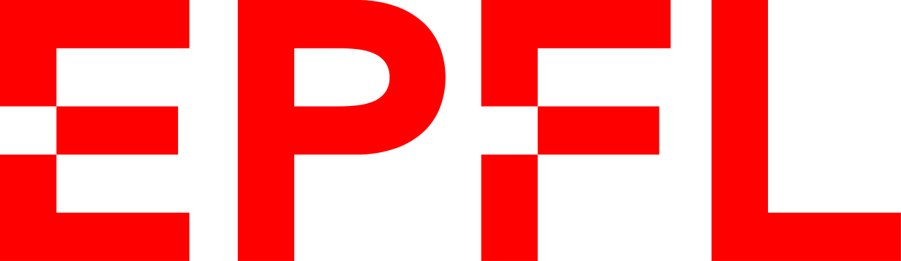
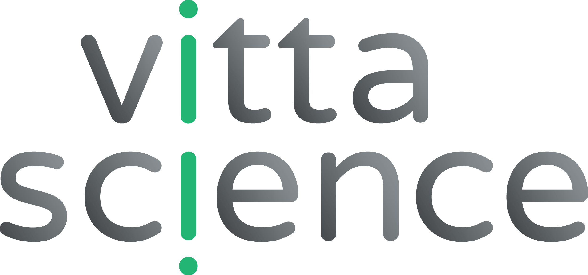

# Curriculum
## 🎓 Education

  

    
<strong>PhD Candidate in Applied Mathematics</strong>

    
Centre Borelli, ENS Paris-Saclay & Michelin

    
Thesis: <em>Convergence acceleration of a nonlinear solver through physics-informed statistical learning</em>

    
Supervisors:
      <a href="https://sites.google.com/site/mougeotmathilde/" class="supervisor">Mathilde Mougeot</a>,
      <a href="https://fdevuyst.jimdofree.com/" class="supervisor">Florian De Vuyst</a>,
      Thibault Dairay
    

  

  
2024–2027

  

    
<strong>Engineering Degree in Mathematical Engineering & Data Science</strong>

    
<strong>Bachelor’s and Master’s Degree in Mathematics</strong>

    
Polytech Clermont-Ferrand

  

  
2021–2024

  

    
<strong>Classe Préparatoire MPSI-MP</strong>

    
Lycée La Fayette, Clermont-Ferrand

    
Ranked on CCINP final exam

  

  
2019-2021

  

    
<strong>French Baccalauréat in Mathematics</strong>

    
Lycée Virlogeux, Riom  

    
European Section (English & Mathematics focus)

  

  
2019

## 📚 Teaching

  

    
<strong>Teaching Assistant</strong> Méthodes Mathématiques (TD, 28h)

    
Bachelor level courses (L3). PSL Research University, Paris. 

  

  
*(planned)*

## 🧪 Work Experience

  
  

    <strong>Internship at Michelin (6 months)</strong> Feb–Aug 2024  
    Physically informed learning methods for PDEs.  
    Dimensionality reduction, convergence acceleration of Newton solvers.
  

  
  

    <strong>Internship at EPFL (4 months)</strong> Apr–Aug 2023  
    Soil Mechanics Lab — Geomechanical modeling of rock systems.  
    Optimization, Machine Learning, cluster computing.
  

  
  

    <strong>Web Editor at Vittascience (6 weeks)</strong> Summer 2022 
    Writing SEO-optimized product descriptions for an educational platform.
  

